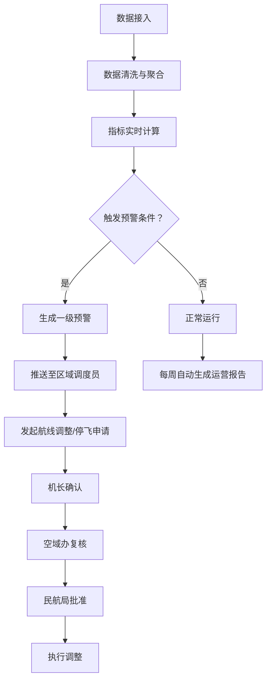

## 1. 产品概述

全国性无人机物流配送运营与安全监测分析平台，面向国家/省/运营企业三级用户，实时接入全国无人机起降点的运行数据，实现配送全流程可视化监测、智能预警、航线规划与运营诊断一体化管理。

- 解决无人机物流规模化运营中的安全监管、效率优化、调度决策等核心问题
- 目标用户：民航局监管人员、省级调度员、运营企业管理人员、区域调度员

## 2. 核心功能

### 2.1 用户角色

| 角色 | 注册方式 | 核心权限 |
|------|----------|----------|
| 国家级管理员 | 系统分配 | 查看全国数据、审批航线调整终审、系统配置 |
| 省级管理员 | 系统分配 | 查看所辖省数据、航线调整复核、查看省级报表 |
| 运营企业管理员 | 系统分配 | 查看本企业数据、预警处理、航线计划上传 |
| 区域调度员 | 系统分配 | 接收预警、查看片区数据、发起航线调整申请 |

### 2.2 功能模块

1. **核心看板**：全国配送时效热力图、故障率排名、省份/机型切换筛选、片区下钻分析
2. **实时监测**：无人机状态监控、航线轨迹追踪、气象数据展示
3. **预警中心**：超时预警、电池健康预警、预警推送、预警处置
4. **审批流程**：三级审批流（机长确认→空域办复核→民航局批准）
5. **航线管理**：航线计划上传、空域批文上传、风险时段预测、绕飞/延迟方案推荐
6. **运营报告**：周报自动生成、同比环比分析、优化建议
7. **权限管理**：三级数据隔离、角色权限配置

### 2.3 页面详情

| 页面名称 | 模块名称 | 功能描述 |
|-----------|----------|----------|
| 核心看板 | 全国时效热力图 | 按省份展示配送时效分布，支持切换省份/机型筛选 |
| 核心看板 | 故障率排名 | 展示各机型/片区故障率排名榜单 |
| 核心看板 | 片区下钻分析 | 点击片区展示近7天趋势、电池衰减、气象影响时间线 |
| 实时监测 | 无人机状态面板 | 展示无人机实时状态（位置、电量、速度、载荷）
| 实时监测 | 航线轨迹 | 在地图上追踪无人机航线轨迹
| 预警中心 | 预警列表 | 展示一级预警（超时、电池健康预警）
| 预警中心 | 预警处置 | 处置预警、发起航线调整申请 |
| 审批中心 | 待审批列表 | 展示待审批事项 |
| 审批中心 | 审批操作 | 机长确认/复核/批准操作
| 航线管理 | 计划上传 | 上传Excel航线计划、空域批文上传
| 航线管理 | 风险预测 | 未来48小时高风险时段预测
| 航线管理 | 方案推荐 | 最优绕飞/延迟方案推荐
| 运营报告 | 周报展示 | 运营诊断报告展示
| 权限管理 | 用户角色管理 | 用户、角色、权限配置 |

## 3. 核心流程

用户登录系统后根据角色进入对应看板，系统实时接入数据清洗聚合计算指标；当触发预警条件时，系统自动推送预警至调度员；调度员可发起航线调整申请，经三级审批通过后执行；系统每周自动生成运营诊断报告。

## 4. 用户界面设计

### 4.1 设计风格
- 主色调：深空蓝 #0F172A，辅助色：科技青 #06B6D4，警示色：琥珀橙 #F59E0B，危险色：警戒红 #EF4444
- 字体：标题使用 Space Grotesk，正文使用 JetBrains Mono
- 按钮风格：圆角矩形，悬浮发光效果
- 布局：深色工业科技感仪表盘布局，卡片式模块化
- 图标风格：线性图标配合数据发光效果

### 4.2 页面设计概览

| 页面名称 | 模块名称 | UI元素 |
|-----------|----------|--------|
| 核心看板 | 时效热力图 | 深色地图底图+渐变色块+数据悬浮卡片 |
| 核心看板 | 故障率排名 | 深色卡片+进度条+发光数据 |
| 实时监测 | 无人机状态 | 状态指示灯+实时数据流 |
| 预警中心 | 预警列表 | 彩色状态标签+脉冲动画预警项 |
| 审批中心 | 审批流程 | 步骤条+状态节点 |
| 航线管理 | 风险预测 | 时间轴+高亮风险区 |

### 4.3 响应式
桌面端优先设计，支持1440px及以上屏幕优化；平板自适应；移动端核心数据展示精简优化。
