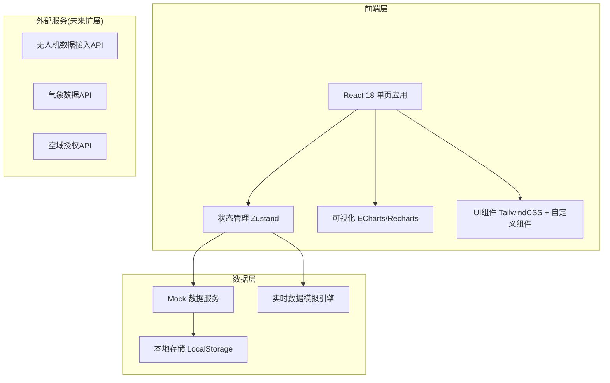
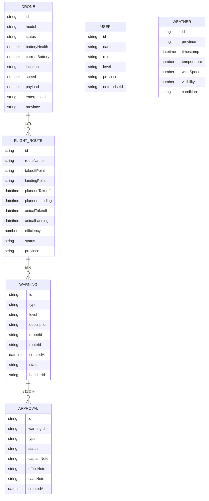

## 1. 架构设计



## 2. 技术说明

- 前端：React@18 + TypeScript + TailwindCSS@3 + Vite
- 初始化工具：Vite
- 后端：无后端，使用前端 Mock 数据服务模拟
- 数据库：LocalStorage 本地持久化，前端 Mock 数据
- 可视化：ECharts（地图热力图）+ Recharts（统计图表）
- 状态管理：Zustand
- 路由：React Router v6
- 图标：Lucide React

## 3. 路由定义

| 路由 | 用途 |
|------|------|
| /dashboard | 核心看板（首页） |
| /monitoring | 实时监测 |
| /alerts | 预警中心 |
| /approvals | 审批中心 |
| /routes | 航线管理 |
| /reports | 运营报告 |
| /permissions | 权限管理 |
| /login | 登录页 |

## 4. 数据模型

### 4.1 数据模型定义



### 4.2 核心计算指标

```typescript
// 配送时效
interface DeliveryEfficiency {
  plannedDuration: number;      // 计划时长(分钟)
  actualDuration: number;       // 实际时长(分钟)
  onTimeRate: number;           // 准时率(%)
  avgDelay: number;             // 平均延误(分钟)
}

// 能耗效率
interface EnergyEfficiency {
  powerConsumption: number;     // 能耗(kWh)
  distancePerKwh: number;       // 每kWh飞行距离(km)
  payloadPerKwh: number;        // 每kWh运载量(kg)
}

// 电池健康度
interface BatteryHealth {
  healthPercentage: number;     // 健康度(%)
  cycleCount: number;           // 充放电循环次数
  capacityDecay: number;        // 容量衰减率(%)
}

// 空域冲突率
interface AirspaceConflict {
  totalFlights: number;
  conflictCount: number;
  conflictRate: number;         // 冲突率(%)
}

// 用户满意度
interface UserSatisfaction {
  totalDeliveries: number;
  complaintCount: number;
  satisfactionRate: number;     // 满意度(%)
  complaintTypes: Record<string, number>;
}
```

## 5. 前端文件结构

```
src/
├── assets/              # 静态资源
├── components/          # 通用组件
│   ├── Layout/          # 布局组件
│   ├── Dashboard/       # 看板组件
│   ├── Monitoring/      # 监测组件
│   ├── Alerts/          # 预警组件
│   ├── Approvals/       # 审批组件
│   ├── Routes/          # 航线组件
│   ├── Reports/         # 报告组件
│   └── UI/              # UI基础组件
├── data/                # Mock数据
├── hooks/               # 自定义Hooks
├── pages/               # 页面组件
├── store/               # Zustand状态管理
├── types/               # TypeScript类型定义
├── utils/               # 工具函数
├── App.tsx
├── main.tsx
└── index.css
```
